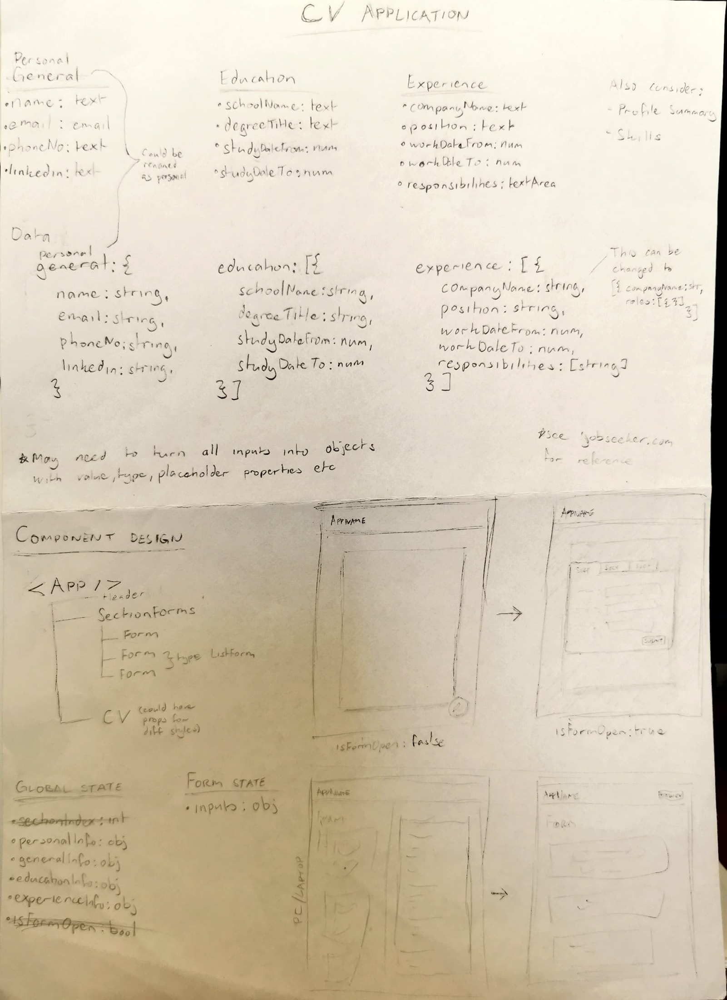

# CV Formatter

This repository contains an application that formats CV information into a layout that is more recruiter-friendly.

## Technologies Used

- Vite
- React
- JavaScript
- CSS

## Installation

1. **Clone the repository**:

   ```bash
   git clone https://github.com/ishmyles/cv-application.git
   cd cv-application
   ```

2. **Install dependencies**:

   ```bash
   npm install
   ```

3. **Start the application**:

   ```bash
   npm run dev
   ```

   The app will be accessible at `http://localhost:5173`.

4. **Terminating the application**:

   Press Ctrl + C to terminate app.

## App Design


